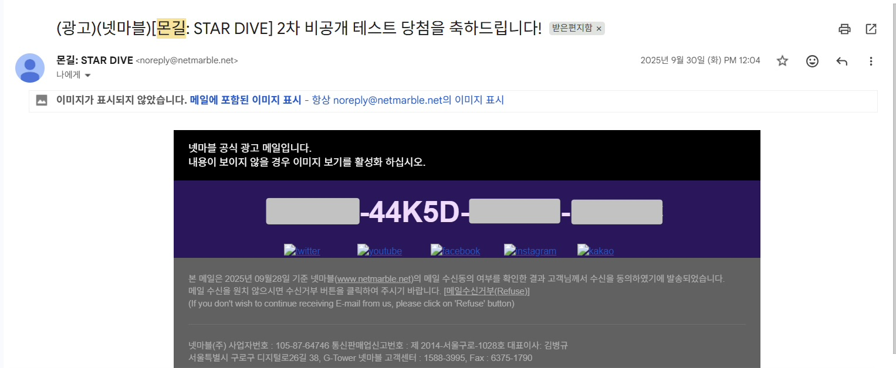

## 몬길:스타다이브 2차 비공게 테스트

> 서비스 종료로 아쉬움을 남겼던 '몬길'의 세계관을 바탕으로, PC 환경에서 새롭게 탄생한 '몬길: 스타다이브
몬스터 길들이기는 섭종 전 즐겨하던 게임이라 신청하게 되었다. 

### 후기
1. 시각적 피로도 개선
- 스킬 이펙트와 함께 화면이 흔들리는 연출이 초반에는 괜찮았는데 후반대로 가면 갈 수록, 시각적 피로도가 높았다. 
    - 'World of Warcraft', 'Raft'와 같은 개임과 같이 시점을 흔들리지 않게 고정하는 것이나 움직임을 최소화 하는 방법을 넣어 유저가 선택할 수 있게 하면 좋을 것 같았다.

| 특히 정밀한 컨트롤이 필요한 상위 콘텐츠로 갈수록 화면 흔들림은 단순한 연출을 넘어 '시각적 노이즈'로 작용하여, 게임의 완성도를 저해하는 요소가 될 우려가 있다.
 
2. 조작 자율성 및 공간 활용도 확대
- 유저의 이동 범위가 지면으로만 구현되었다.
    - 지형지물을 활용한 입체적인 탐험이나 전략적인 위치 선정이 불가능하여 공간을 활용하기에 어려움이 있었다.

| 유저가 게임 내 환경과 상호작용할 수 있는 수단이 줄어들어 '플레이 흐름'이 정적으로 느껴지고, 이것이 곧 지루함으로 이어질 수 있다는 점이 우려된다.
